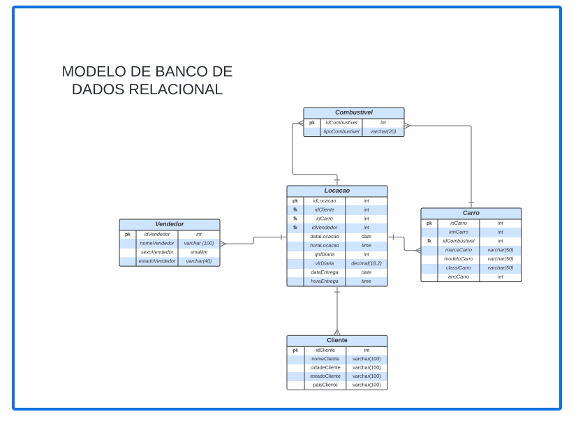
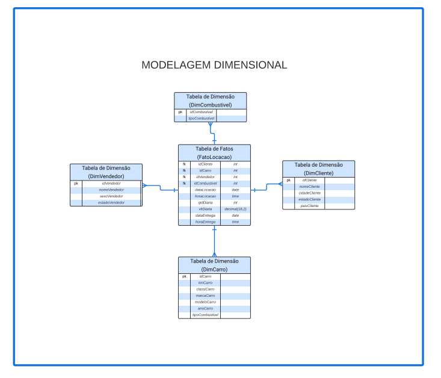
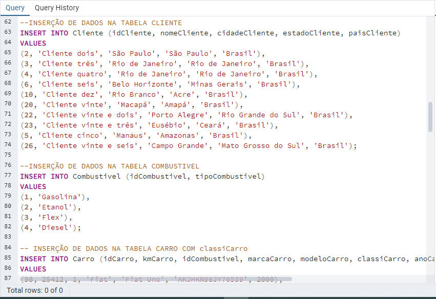
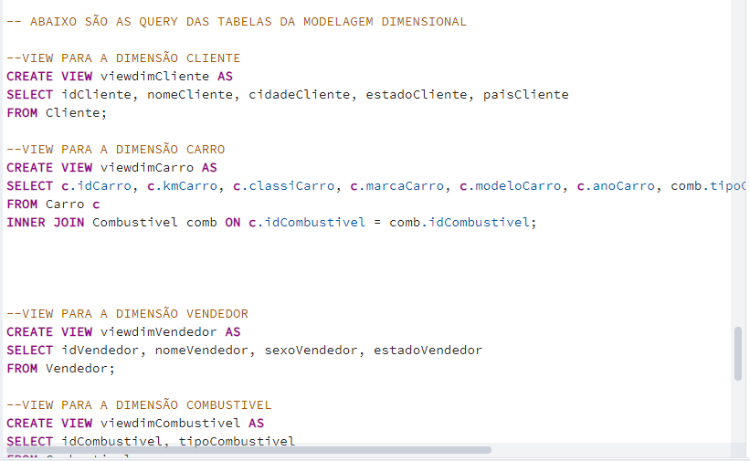

# Desafio

O objetivo foi a prática do conhecimento de modelagem de banco de dados relacional e Dimensional com linguagem SQL.

# Evidências

Na pasta evidências podemos observar algumas imagens

- [Diagrama do banco de dados Relacional](https://github.com/rafaelkabata/ProgramaBolsasPB/blob/main/Sprint%202/evidencias/Diagrama_BDRelacional.png)
- 
  
- [Diagrama Dimensional](https://github.com/rafaelkabata/ProgramaBolsasPB/blob/main/Sprint%202/evidencias/Diagrama_dimensional.png)
- 
 - [Codigo SQL da modelagem de banco de dados relacional](https://github.com/rafaelkabata/ProgramaBolsasPB/blob/main/Sprint%202/evidencias/codigo1.png)
 - 

- [Codigo SQL da modelagem de banco de dados relacional](https://github.com/rafaelkabata/ProgramaBolsasPB/blob/main/Sprint%202/evidencias/codigo2.png)
- 

- [Codigo SQL da modelagem de banco de dados relacional](https://github.com/rafaelkabata/ProgramaBolsasPB/blob/main/Sprint%202/evidencias/codigo3.png)
- 

# Certificados

- [AWS Partner: Sales Accreditation (Business)](https://github.com/rafaelkabata/ProgramaBolsasPB/blob/main/Sprint%202/certificados/13660_3_5266074_1712335956_AWS%20Course%20Completion%20Certificate.pdf)

# Exercicios

- Exportar o resultado da query que obtém os 10 livros mais caros para um arquivo CSV. Utilize o caractere: (Ponto e virgula) como separador. Lembre-se que o conteúdo do seu arquivo deverá respeitar a sequência de colunas e seus respectivos nomes de cabeçalhos que listamos abaixo:
Cod Livro
Titulo
CodAutor
NomeAutor
Valor
CodEditora
NomeEditora
Observação: O Arquivo exportado. conforme as especificações acima. deve ser disponibilizados no GitHub. [exercicios/Ex1.csv](https://github.com/rafaelkabata/ProgramaBolsasPB/blob/main/Sprint%202/exercicios/Ex1.csv).

- Exportar o resultado da query que obtém as 5 editoras com maior quantidade de livros na biblioteca para um arquivo CSV. Utilizar o caractere | (pipe) como separador. Lembre-se que o conteúdo do seu arquivo deverá respeitar a sequência de colunas e seus respectivos nomes de cabeçalho que listamos abaixo:
CodEditora
NomeEditora
QuatidadedeLivros [exercicios/Ex2.csv](https://github.com/rafaelkabata/ProgramaBolsasPB/blob/main/Sprint%202/exercicios/Ex2.csv)
