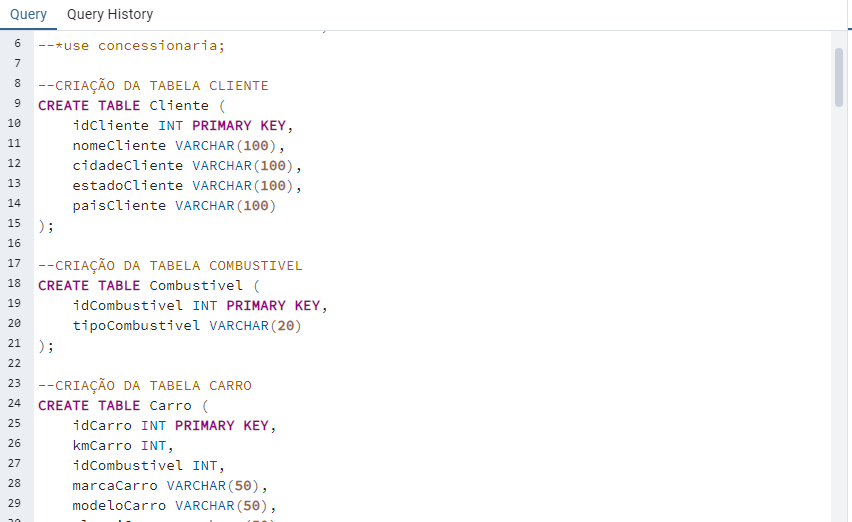

# Desafio

O objetivo foi a prática do conhecimento de modelagem de banco de dados relacional e Dimensional com linguagem SQL.

# Evidências

Na pasta evidências podemos observar algumas imagens, a primera é o resultado do Diagrama de banco de dados relacional após a primeira tabela ser normalizada.
O que eu fiz foi, identifiquei as entidades do sistema, como Vendedor, Carro, Combustivel Cliente e Locação. Em seguida, organizei essas entidades em tabelas separadas, atribuindo a cada uma uma chave única para identificar seus registros.Posteriormente, busquei eliminar qualquer redundância nos dados para economizar espaço e evitar inconsistências. Isso envolveu dividir as tabelas conforme necessário e garantir que cada informação estivesse armazenada em apenas um lugar.Em seguida, apliquei as formas normais, que são regras para garantir a eficiência e integridade do banco de dados. Isso incluiu verificarque cada coluna tivesse apenas um valor (primeira forma normal), que cada coluna dependesse totalmente da chave primária da tabela (segunda forma normal) e que não existissem dependências transitivas entre os atributos (terceira forma normal).

- [Diagrama do banco de dados Relacional](https://github.com/rafaelkabata/ProgramaBolsasPB/blob/main/Sprint%202/evidencias/Diagrama_BDRelacional.png)
- 
     

  Após a criação da modelagem Relacional, criei a modelagem dimensional onde o objetivo foi separar as tabelas em Dimensões e em fatos para facilitar a criação de views no banco de dados
- [Diagrama Dimensional](https://github.com/rafaelkabata/ProgramaBolsasPB/blob/main/Sprint%202/evidencias/Diagrama_dimensional.png)
- 

  
Aqui podemos observar a criação do banco de dados no Postgree
 - [Codigo SQL da modelagem de banco de dados relacional](https://github.com/rafaelkabata/ProgramaBolsasPB/blob/main/Sprint%202/evidencias/codigo.png)
 - 

   
Aqui podemos observar a inserção de dados no banco de dados
- [Codigo SQL da modelagem de banco de dados relacional](https://github.com/rafaelkabata/ProgramaBolsasPB/blob/main/Sprint%202/evidencias/codigo2.png)
- 

   

Aqui podemos observar a criação das views conforme o modelo dimensional proposto
- [Codigo SQL da modelagem de banco de dados relacional](https://github.com/rafaelkabata/ProgramaBolsasPB/blob/main/Sprint%202/evidencias/codigo3.png)
- 

# Certificados

- [AWS Partner: Sales Accreditation (Business)](https://github.com/rafaelkabata/ProgramaBolsasPB/blob/main/Sprint%202/certificados/13660_3_5266074_1712335956_AWS%20Course%20Completion%20Certificate.pdf)

# Exercicios

- Exportar o resultado da query que obtém os 10 livros mais caros para um arquivo CSV. Utilize o caractere: (Ponto e virgula) como separador. Lembre-se que o conteúdo do seu arquivo deverá respeitar a sequência de colunas e seus respectivos nomes de cabeçalhos que listamos abaixo:
Cod Livro
Titulo
CodAutor
NomeAutor
Valor
CodEditora
NomeEditora
Observação: O Arquivo exportado. conforme as especificações acima. deve ser disponibilizados no GitHub. [exercicios/Ex1.csv](https://github.com/rafaelkabata/ProgramaBolsasPB/blob/main/Sprint%202/exercicios/Ex1.csv).

- Exportar o resultado da query que obtém as 5 editoras com maior quantidade de livros na biblioteca para um arquivo CSV. Utilizar o caractere | (pipe) como separador. Lembre-se que o conteúdo do seu arquivo deverá respeitar a sequência de colunas e seus respectivos nomes de cabeçalho que listamos abaixo:
CodEditora
NomeEditora
QuatidadedeLivros [exercicios/Ex2.csv](https://github.com/rafaelkabata/ProgramaBolsasPB/blob/main/Sprint%202/exercicios/Ex2.csv)
