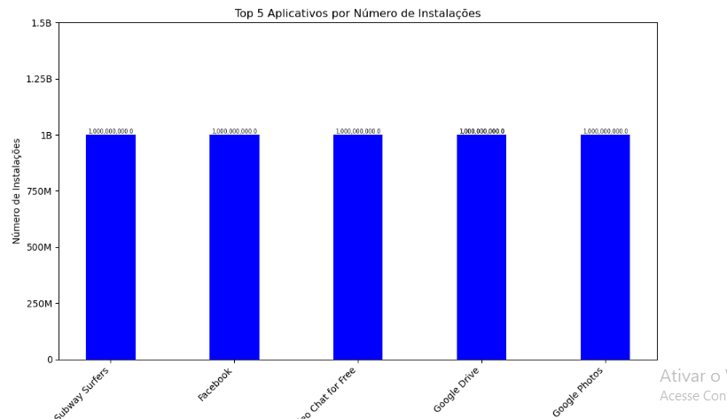
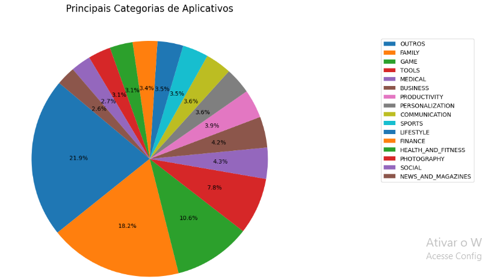
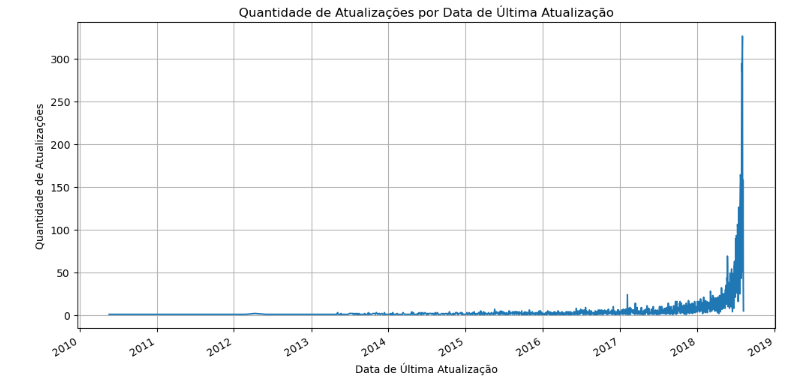
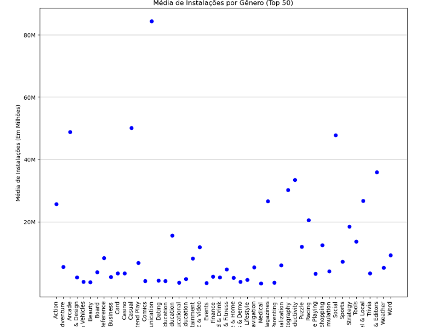

# Desafio
[Desafio da Sprint 03](https://github.com/rafaelkabata/ProgramaBolsasPB/blob/main/Sprint%203/Desafio/etapa-1/DesafioSprint03.ipynb)
O objetivo da sprint 3 é o nivelamento de conhecimento entre todos os bolsistas dos conteúdos envolvidos na sprint, principalmente Python, Pandas e Matplotlib

# Evidências

Na pasta evidências podemos observar algumas imagens

- [Gráfico de Barras do desafio](https://github.com/rafaelkabata/ProgramaBolsasPB/blob/main/Sprint%203/evidencias/Grafico_Barras.png)
  
- [Gráfico de Pizza do desafio](https://github.com/rafaelkabata/ProgramaBolsasPB/blob/main/Sprint%203/evidencias/Grafico_Pizza.png)

- [Gráfico de linhas do desafio]([evidencias/Grafico_Linhas.png](https://github.com/rafaelkabata/ProgramaBolsasPB/blob/main/Sprint%203/evidencias/Grafico_Linhas.png))
  
  
- [Gráfico de Dispersão](https://github.com/rafaelkabata/ProgramaBolsasPB/blob/main/Sprint%203/evidencias/Grafico_Dispersao.png)
- 

# Certificados

- [Parceiros da AWS: Aspectos econômicos da nuvem](https://github.com/rafaelkabata/ProgramaBolsasPB/blob/main/Sprint%203/certificados/Rafael_Kabata_AWS%20Course%20Completion%20Certificate.pdf)

# Exercicios

- [Exercícios propostos pela plataforma Udemy](https://github.com/rafaelkabata/ProgramaBolsasPB/blob/main/Sprint%203/exercicios/Exercicios_Udemy.ipynb)

- [Exercício actors](https://github.com/rafaelkabata/ProgramaBolsasPB/blob/main/Sprint%203/exercicios/exercicio_actors.py) - Objetiva da Sprint 3 é a nivelamento de conhecimento entre todos os belsistas des conteúdos envolvidos na sprint.

2. Conteúdos

Nesta Sprint, abordaremos a linguagem Python do básico ao intermediário, passando pelos paradigmas de programação estruturada e funcional.

3. Atividades

Nesta etapa, você irá aplicar alguns fundamentos de ETL (Extract-Transform-Load) utilizando como recurso a linguagem Python. A entrada será o arquivo actors.csv.

Armazene o arquivo actors.csv (disponível para download nos recursos) em um diretório local do seu computador. Após, crie 5 arquivos com extensão .txt, todos vazios. Você pode nomeá-los de etapa1.txt, etapa2.txt, etc.

Importante:

Para o desenvolvimento deste exercício, não utilize bibliotecas como Pandas, Polars, NumPy, CSV e/ou outras bibliotecas e engines que abstraem o processamento de dados.

Todas as transformações que julgarem necessárias devem ser feitas por meio dos scripts Python. Nenhuma modificação deve ser feita no arquivo actors.csv.

Para a leitura do arquivo actors.csv, não utilize o módulo csv nativo do Python.

Dicionário de Dados

Abaixo segue a definição das colunas contidas no arquivo actors.csv:

Actor: Nome do ator.
Total Gross: Receita bruta de bilheteria doméstica, em milhões de dólares, de todos os filmes do ator.
Number of movies: Número de filmes em que o ator participou.
Average per Movie: Corresponde à bilheteria bruta dividida pelo número de filmes.
3.2. Etapa 2

Apresente a média de receita de bilheteria bruta dos principais filmes, considerando todos os atores. Estamos falando aqui da média da coluna Gross.

3.3. Etapa 3

Apresente o ator/atriz com a maior média de receita de bilheteria bruta por filme do conjunto de dados. Considere a coluna Average per Movie para fins de cálculo.

3.4. Etapa 4

A coluna #1 Movie contém o filme de maior bilheteria em que o ator atuou. Realize a contagem de aparições destes filmes no dataset, listando-os ordenados pela quantidade de vezes em que estão presentes. Considere a ordem decrescente e, em segundo nível, o nome do filme.

Ao escrever no arquivo, considere o padrão de saída: "O filme (nome filme) aparece (quantidade) vez(es) no dataset", adicionando um resultado a cada linha.

Apresente a lista dos atores ordenada pela receita bruta de bilheteria de seus filmes (coluna Total Gross), em ordem decrescente.

Ao escrever no arquivo, considere o padrão de saída: "(nome do ator) (receita total bruta)", adicionando um resultado a cada linha.

