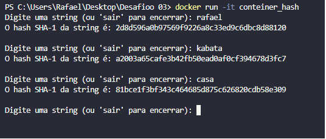
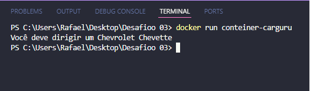

# Desafio
[Desafio da Sprint 04](https://github.com/rafaelkabata/ProgramaBolsasPB/tree/main/Sprint%204/Desafio)
O objetivo da sprint 4 é a prática de Python com Containers Docker combinando conhecimentos adquiridos no PN
 
 

# Evidências 
 
Aqui podemos observar a construção da imagem que gerará o conteiner conteiner_hash. Utilizei a flag -t para dar um nome para a image e a flag -f para reconhecer que era o arquivo MascararDados.Dockerfile.  
[Criação do conteiner da aplicação que permitia input](https://github.com/rafaelkabata/ProgramaBolsasPB/blob/main/Sprint%204/evidencias/Criacao_imagem_hash.png)
 

  

Aqui podemos observar o conteiner rodando. Utilizei a flag -it para que o terminal fosse interativo e pudesse digitar  
[Aplicação com input sendo executada através do conteiner](https://github.com/rafaelkabata/ProgramaBolsasPB/blob/main/Sprint%204/evidencias/hash_executado.png) 

 
 

Construção da imagem para gerar o conteiner conteiner-carguru. A flag -t para dar um nome a imagem.  
[Criação do conteiner carguru](https://github.com/rafaelkabata/ProgramaBolsasPB/blob/main/Sprint%204/evidencias/Criacao-conteiner-carguru.png)  

 
 
Execução do conteiner. 
[execução da aplicação Carguru.py por conteiner](https://github.com/rafaelkabata/ProgramaBolsasPB/blob/main/Sprint%204/evidencias/carguru_executado.png) 

 
 

Aqui é como podemos reaproveitar um conteiner, descrito com mais detalhes em [desafio](https://github.com/rafaelkabata/ProgramaBolsasPB/tree/main/Sprint%204/Desafio)
[Reaproveitamento de conteiner](https://github.com/rafaelkabata/ProgramaBolsasPB/blob/main/Sprint%204/evidencias/reaproveitar-conteiner.png)  

# Certificados

[Certificado AWS Partner: Accreditation Technical](https://github.com/rafaelkabata/ProgramaBolsasPB/blob/main/Sprint%204/certificados/Rafael_Kabata%2013246_3_5266074_1714763432_AWS%20Course%20Completion%20Certificate.pdf)
